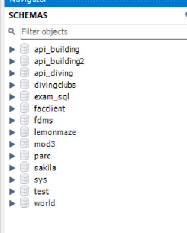
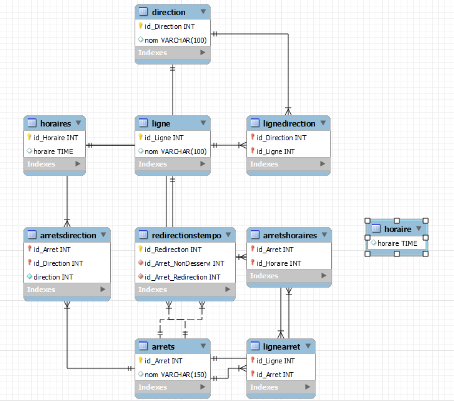

# Installation et utilisation

## 1. Télécharger le fichier

https://github.com/Theo22100/exam-sql/tree/main

## 2. Création de la BDD :

Lancer MySQL Workbench, choississez un profil avec des droits (le profil root par exemple)

Puis Clique droit sur la fenêtre schéma -> Create Schema

Puis Apply, une autre page apparait, veuillez appuyer sur Apply

Puis Finish

## 3. Ajouter le script schema.sql : 

File -> Open SQL Script -> Sélectionner schema.sql dans le dossier téléchargé

Puis cliquer sur l'éclair qui est sélectionné sur la photo au-dessus, le script devrait normalement se lancer.

## 4. Ajouter le script data.sql

Effectuer la même étape qu'au dessus mais pour le fichier data.sql

## 5. Ajouter le script queries.sql

Effectuer la même étape qu'au dessus mais pour le fichier queries.sql

## 6. Exercice 8

### Fonctionnement Index

Les index sont des structures de données utilisés pour permettre d’améliorer les performances de requête dans une base de données.
Un index stocke des valeurs de colonnes spécifiques dans une structure optimisée pour permettre une recherche rapide. 
Lorsqu'un index est créé sur une colonne, la base de données crée une copie triée de cette colonne avec des pointeurs vers les lignes correspondantes de la table. 
Lorsqu'une requête est exécutée, la base de données peut utiliser cet index pour localiser rapidement les enregistrements correspondants, ce qui réduit le temps nécessaire pour parcourir la table entièrement.

### Différence index B-tree et Hash

Un Index B-Tree organise les données sous forme d'arbre équilibré où chaque nœud contient plusieurs clés triées, permettant des recherches efficaces et des intervalles de recherche. L'avantage principal de l'index B-Tree est sa polyvalence, car il peut être utilisé pour des opérations de recherche exacte ainsi que des recherches par plage.

### Conclusion

Un Index Hash est un index de hachage organise les données dans une table de hachage, où les valeurs de la colonne indexée sont hachées pour générer une clé de hachage. Cette clé est ensuite utilisée pour accéder directement à la position de la valeur dans la table. Il ne peut pas être utilisé pour trier les données.

En résumé, les index de type B-Tree et de hachage sont deux méthodes couramment utilisées pour accélérer l'accès aux données dans une base de données. Cependant, l'index Hash utilise une structure de table de hachage, offrant des recherches rapides pour des valeurs exactes mais ne prenant pas en charge les recherches par plage ni le tri des données alors que l'index B-Tree si.

## 7. Exercice 9

id_Arret dans la table arrets : Cette colonne est souvent utilisée pour rechercher des arrêts spécifiques

id_Ligne dans la table ligne et lignedirection : Les requêtes impliquent fréquemment la récupération des lignes spécifiques ou des liaisons entre lignes et directions

id_Direction dans la table direction et lignedirection : Les requêtes impliquent fréquemment la récupération de directions spécifiques ou des liaisons entre lignes et directions

id_Horaire dans la table horaires et arretshoraires : Les requêtes impliquent fréquemment la récupération des horaires spécifiques ou des liaisons entre arrêts et horaires

id_Arret_NonDesservi et id_Arret_Redirection dans la table redirectionstempo : Les requêtes concernent les redirections d'arrêts

## MCD

MCD réalisé avec WorkBench :

